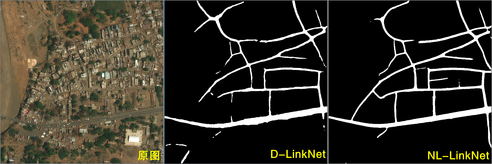

# Road-Extraction
本项目用于卫星遥感影像道路分割任务，目前包含算法：
- UNet
- D-UNet
- LinkNet
- D-LinkNet
- NL-LinkNet




## Prerequisites
- Cuda 10.0
- Python 3.8
- Torchvision 0.8.2
- Torch 1.7.1
- Opencv 4.7.0.68

## Usage

### 1.安装torch、torchvision

在[此处](https://download.pytorch.org/whl/torch_stable.html)根据Cuda版本选择合适的文件下载安装

### 2.安装剩余模块其它依赖
```
pip install -r requriements.txt
```

### 3.下载DeepGlobe数据集

下载地址：[百度网盘](https://pan.baidu.com/s/1chOnMUIzcKUzQr1LpuJohw?pwd=8888)

下载完放置在文件夹`dataset`中

    ├── dataset
    │   ├── train
    │   │   ├── *_sat.jpg 
    │   │   ├── *_mask.png 
    │   │   └── ...
    │   ├── test
    │   │   ├── *_sat.jpg 
    │   │   └── ...
    │   └── valid
    │       ├── *_sat.jpg
    ├──────── ...

### 4.训练模型(可选)

运行train.py即可训练模型

### 5.推理

下载训好的模型
[百度网盘](https://pan.baidu.com/s/1MgICrnkp2CfHmjP0dgZAlA?pwd=8888)

里面包含D-LinkNet、NL-LinkNet两个模型参数，放置在`weights`文件夹下

运行segment.py进行推理，推理结果在`results`文件夹中可以找到

### 6.验证(可选)
运行eval.py可得到单张图像acc、miou等指标信息


## References
[1] https://github.com/zlckanata/DeepGlobe-Road-Extraction-Challenge

[2] https://github.com/yswang1717/NLLinkNet

## Star History

如果此项目对你有所帮助，请给项目点个star

